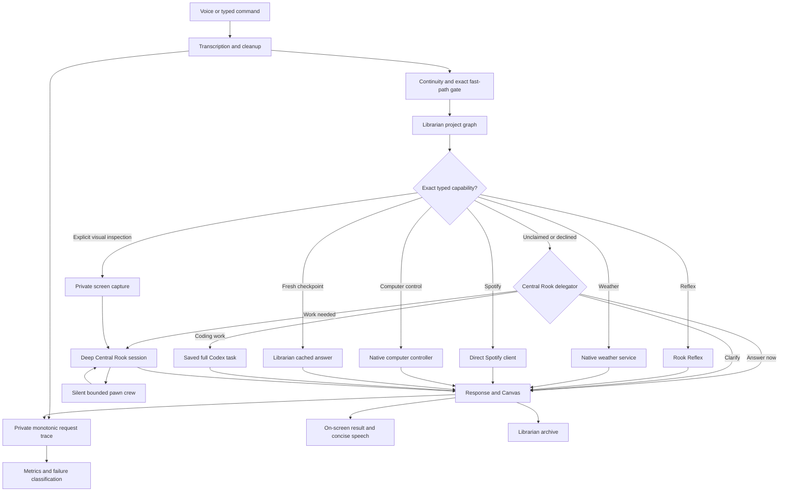
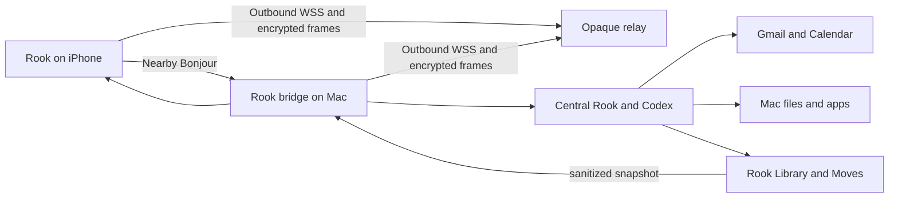

# Rook Architecture

Rook is a private native macOS command center with a local-first fast path and a guarded Codex-backed deliberate path. The application is split into a reusable Swift library (`RookKit`) and the macOS executable (`RookCore`). A native iOS companion target is in development; it reuses Rook's response and Canvas contracts while the Mac retains execution authority.

## Request flow

## Components

| Area | Source | Responsibility |
|---|---|---|
| Models and schemas | `Sources/RookKit/Models.swift` | Codable response, Canvas, pawn-result/evidence, and checkpoint contracts |
| Task tracing and recovery | `Sources/RookKit/RookTaskTrace.swift` | Persists private monotonic request stages, classifies failures, recommends bounded recovery, and summarizes first-attempt success and latency |
| Routing benchmark | `Sources/RookKit/RookRoutingBenchmark.swift` | Verifies exact fast paths and that semantic or compound work reaches Central Rook intact |
| Deterministic gate | `Sources/RookKit/LocalRookRouter.swift` | Answers only exact conversational checks and otherwise produces an empty Central Rook handoff |
| Inference preflight | `Sources/RookKit/RookInferenceLayer.swift` | Resolves retries, approval continuations, and unique recent referents without semantically guessing a new request's owner |
| Direct capability guide | `Sources/RookKit/RookDirectCapabilityGuide.swift` | Attempts the ordered exact no-pawn adapters and leaves semantic, compound, unsupported, or uncertain work unclaimed |
| Central delegator | `Sources/RookKit/RookStreamingClient.swift`, `Sources/RookCore/RookAppDelegate.swift` | Uses one prewarmed read-only structured pass to answer, clarify, or start deep Central work with an optional pawn plan |
| Full Codex coding handoff | `Sources/RookKit/RookCodingTask.swift`, `Sources/RookCore/RookAppDelegate.swift` | Creates one saved non-ephemeral Codex task in the verified checkout, inherits normal Codex configuration, persists its thread/outcome, and reports through Activity and Library |
| Legacy hybrid compatibility | `Sources/RookKit/RookHybridCapabilityPlan.swift`, `RookTaskExecutor.swift` | Safely resumes an already-open Spotify workflow, preserving verified dependencies without acting as the primary router |
| Reflex parsing | `Sources/RookKit/RookReflexIntent.swift` | Recognizes bounded calculations, conversions, alerts, and device commands |
| Direct Spotify | `Sources/RookKit/RookSpotify.swift` | Parses exact account commands, ranks personal playlists for study/work/focus intent from titles and descriptions, refreshes OAuth access, resolves playlists and catalog items, controls Spotify Connect devices, and returns attributed Spotify Canvas panels |
| Codex integration | `Sources/RookKit/CodexBridge.swift` | Runs central Rook, checkpoints, policy profiles, and bounded crews |
| Private Canvas media | `Sources/RookKit/RookMediaStore.swift` | Recovers generated-image artifacts, validates explicit screen captures and raster bytes, stores private copies, and validates public HTTPS image sources |
| Library | `Sources/RookKit/RookLibrary.swift` | Archives conversations, tasks, checkpoints, and learned preferences |
| Project graph | `Sources/RookKit/RookLibraryGraph.swift` | Seeds project identity and bounded source provenance from the high-level local Codex memory registry, persists project/category/topic nodes, writes inspectable Obsidian-compatible notes, and resolves implicit references by semantic match, recency, and dominant activity |
| Conversation continuity | `Sources/RookKit/RookLibrary.swift` | Resolves bounded retry references and supplies graph-ranked context plus a newest-first recent thread |
| App orchestration | `Sources/RookCore/RookAppDelegate.swift` | Owns request lifecycle, UI state, speech, routing, and completion |
| Voice | `Sources/RookCore/VoiceController.swift`, `LocalWakeWordDetector.swift` | Streams audio to an isolated local wake process while retaining one continuous on-device Apple command transcript, adaptive endpointing, and speech playback |
| Wake runtime | `Sources/RookWakeTool/`, `WakeModel/`, `scripts/train-livekit-wake.sh` | Runs the pinned LiveKit WakeWord Swift/ONNX stack, trains a Rook-owned classifier, and emits only bounded readiness/wake events |
| Fast services | `Sources/RookCore/RookWeatherService.swift`, `RookReflexController.swift`, `RookComputerController.swift` | Executes narrow local capabilities without model latency |
| Private screen capture | `Sources/RookKit/RookScreenCaptureIntent.swift`, `Sources/RookCore/RookScreenCaptureController.swift` | Recognizes explicit capture requests, targets a display or visible window with ScreenCaptureKit, stores an opaque private image, and attaches it to central Rook |
| Command center | `Sources/RookCore/RookDashboardView.swift`, `RookCanvasView.swift` | Renders Today, Pawns, Moves, Canvas, and the clickable Library graph/pawn evidence inspectors |
| Skill | `skill/rook/` | Defines interactive Rook policy, approval queue, voice snippets, and local speech utility |
| Mobile protocol | `Sources/RookKit/RookMobileProtocol.swift` | Defines versioned phone/Mac messages and validates direction, authentication, size, and replay windows |
| Mobile pairing | `Sources/RookKit/RookMobilePairingStore.swift`, `RookMobileSecureChannel.swift` | Creates expiring address-free QR offers, encrypts bridge frames, hashes session tokens, and supports device revocation |
| Mobile bridge | `Sources/RookCore/RookMobileBridgeServer.swift`, `RookMobileRelayHostConnection.swift` | Advertises Rook with Bonjour, maintains outbound relay links, authenticates paired devices, routes commands to central Rook, and projects sanitized state |
| iPhone companion | `Mobile/`, `RookMobile.xcodeproj` | Renders Today, Canvas, Library, Moves, and foreground push-to-talk on iOS |
| Opaque relay | `Relay/` | Role-separates paired host/phone WebSockets and forwards bounded binary frames without storing or decrypting them |

## Trust boundaries

1. The inference preflight resolves pending answers, retries, approvals, and unique recent referents before literal parsing. Only an exact typed parser may bypass Central Rook; semantic, compound, unsupported, and uncertain requests remain intact and unclaimed.
2. The prewarmed Central Rook delegator is read-only and returns only a structured answer, clarification, or deliberate handoff. It has no tools or external-action authority.
3. Task pawns and Librarian workers may inspect or reason but never speak, mutate external systems, or control apps.
4. Central Rook is the only user-visible synthesis and action authority.
5. Consequential commitments require an exact approval or mandatory user handoff.
6. Private state stays under `~/.codex/rook`; generated Canvas images and explicitly requested screen captures are copied into the mode-700 media directory and represented in Canvas only by native-minted opaque IDs. Capture paths never enter model output, capture contents never enter speech or Library records, and the image is attached only to the authenticated central Codex request that must inspect it. Generated app bundles and model files are excluded from Git.
7. The iPhone never receives the ChatGPT credential or launches Codex. It sends only authenticated commands and exact move decisions to central Rook on the Mac. The remote relay sees only a random channel identifier and opaque encrypted frames.
8. Mobile approvals require local device authentication, but the Mac still validates the paired session, exact move identifier, current queue state, and normal Rook action boundary.
9. A graph-selected code workspace must be an existing directory under the user's home folder. Central Rook starts there with the private Rook workspace added separately for guarded state writes; live files outrank archived graph context.
10. Direct Spotify receives only an expiring access token from the Keychain-backed OAuth coordinator. It never exposes tokens or raw provider errors, does not mutate playlists or the saved library, and falls back to a clarification when item or device matching is ambiguous. Purpose matching is deterministic and inspectable: study, work, and focus requests consider only the connected library's playlist titles and Spotify descriptions, return at most five likely fits, and preserve those names for the next short playback answer.
11. Pawn inspection exposes only attributable result summaries and bounded evidence. Hidden reasoning, raw pawn messages, credentials, tokens, tracking URLs, and unnecessary private content are never persisted for UI inspection.
12. Online Canvas images require public HTTPS URLs with no local/private host, embedded credentials, auth tokens, or tracking parameters. Generated images use only artifacts recovered from the exact completed Codex session; a model cannot mint or choose a local media path.
13. Every live request has one private request ID and monotonic trace. Failure recovery starts from a structured category such as ambiguity, authentication, permission, timeout, provider availability, policy, dependency, execution, or verification. Rook does not silently switch a supported native domain to Computer Use, and repeated failures may inform a reviewed routing rule but never rewrite authority or permissions automatically.
14. Idle microphone audio is converted once and consumed locally by the Apple command transcriber and, when installed, Rook's isolated LiveKit/ONNX wake process. A bounded 1.2-second PCM pre-roll and the wake process's rolling two-second inference window remain memory-only. The process emits readiness, confidence, and wake timing, never transcript or audio payloads. The owned model remains mode-protected under `~/.codex/rook/wake` and is accepted only with a passing SHA-256-bound corpus report. Apple wake matching is used when the validated local path is unavailable and fallback is enabled.
15. The retained native task-executor slice may resume Spotify-only central steps for an already-open hybrid conversation. It records explicit step state, verifies a playback mutation through read-only player state, rejects stale pre-command context, and passes only bounded track, artist, device, and state receipts to dependent Central Rook research. It does not classify new requests.
16. Coding remains Central-first but is not executed by a Rook-specific mini-agent. Central emits the structured `coding` intent only after understanding the full request; the host then requires one verified checkout and creates one saved non-ephemeral Codex task there. The task inherits normal Codex configuration without Rook's response schema, remains repository-scoped, and is recorded privately for inspection and continuation. Forge pawns never duplicate that task.

## Mobile request flow

The iOS client discovers the paired Mac by a random stable Bonjour service identity. Initial pairing uses a five-minute QR secret on the same local network; later connections use a per-device session secret held in both Keychains. The phone tries Bonjour first and then the built-in WSS relay. Each relay room name is derived from the session token, but the session token and plaintext never reach the relay. The Mac revalidates encryption, direction, timestamp, replay ID, paired device, and exact queue decisions before routing anything into central Rook.

## Versioned integration

The repository copy at `skill/rook/` is canonical. `scripts/install.sh` synchronizes it to `~/.codex/skills/rook` before launching the app. Any feature that changes routing, safety, state, voice behavior, Canvas, or local capabilities must update both application documentation and the canonical skill in the same change.
