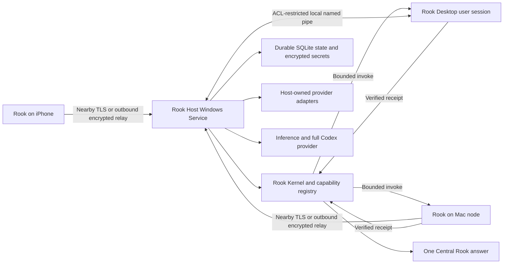

# Always-on Windows Rook Core

Status: implementation-ready design; not implemented.

This document defines the first always-on Windows deployment of Rook. It refines Milestones 4–6 in the [development log](DEVELOPMENT_LOG.md) without changing current behavior: today the macOS application still owns Rook's lifecycle and authority.

## Product decision

The Windows PC has two distinct roles:

1. **Rook Host** is the single always-on authority. It owns durable requests, conversations, Library state, approvals, capability selection, provider state, task receipts, recovery, and the final answer.
2. **Rook Desktop** is a login-scoped Windows capability node. It owns interactive Windows surfaces such as voice, notifications, visible apps, screen capture, and computer control.

The split is required, not optional. Windows services run in non-interactive Session 0 and cannot safely inspect or control a signed-in user's desktop. Microsoft recommends a separate user-session application communicating with the service through IPC such as named pipes. See [Interactive Services](https://learn.microsoft.com/en-us/windows/win32/services/interactive-services) and [Service Changes for Windows Vista](https://learn.microsoft.com/en-us/windows/win32/services/service-changes-for-windows-vista).

The Windows PC is therefore the always-on Core host and also contributes a Windows node when Noah is signed in. The Mac becomes a separate capability-bearing node. The iPhone remains a client. There is exactly one configured authority and no leader election in this milestone.

## User experience

Ordinary use should expose outcomes and device availability, not topology.

- **Rook is online** means the Windows service is healthy and can accept requests.
- **This PC is available** means the signed-in Windows companion is connected and its relevant permissions are ready.
- **Your Mac is available** means the paired Mac node is online and has advertised the required capability.
- **Needs attention** means one exact setup, authentication, permission, update, or recovery step is required.

The tray menu contains only:

- Open Rook
- Rook is online / Needs attention
- This PC: Available / Locked / Signed out
- Mac: Available / Offline
- Phone: Connected / Not connected
- Connections
- Diagnostics
- Quit Rook Desktop

Quitting Rook Desktop does not stop Rook Host. Stopping the host is a separate administrator action in Diagnostics and clearly explains that Rook will go offline.

### First-run flow

1. Install the signed Rook package with one administrator elevation.
2. The installer registers and starts Rook Host with automatic delayed start and installs Rook Desktop for the designated Windows user.
3. Rook Desktop verifies service health, storage encryption, outbound relay access, sleep settings, and the inference provider.
4. Choose **Move Rook to this PC** on the Mac and verify the same short code on both computers.
5. Transfer only durable Rook state. Provider connections are reauthorized on Windows; Mac Keychain tokens are not copied.
6. Re-pair the iPhone to the new authority and pair the Mac as a capability device.
7. Complete one end-to-end verification before the Windows authority accepts normal requests.

Rook may detect that Windows sleep would make it unavailable, but it must not silently change the power plan. It offers one exact, reversible **Keep this PC awake when plugged in** change and requires a direct confirmation.

## Process architecture



### Rook Host

Rook Host starts at boot through the Windows Service Control Manager. A .NET Worker Service is the recommended host shell because it has first-class Windows Service lifecycle, logging, shutdown, and single-file deployment support while remaining usable for a foreground macOS host during extraction. Microsoft documents this model in [Create a Windows Service using `BackgroundService`](https://learn.microsoft.com/en-us/dotnet/core/extensions/windows-service).

The service owns:

- command ingress from local clients and the encrypted relay;
- continuity preflight and Central Rook delegation;
- deep-session and full Codex task launch;
- Library, graph, conversation, approval, checkpoint, and trace state;
- the capability and just-in-time skill registries;
- dependencies, deadlines, cancellation, recovery, and final synthesis;
- host-owned provider adapters and their connection state;
- node registration, capability availability, invocation, and receipts; and
- authoritative projection of Activity, Canvas, Library, and Moves to clients.

The service never:

- captures a screen, drives a desktop, opens an interactive browser, records a microphone, or presents a dialog;
- exposes an unrestricted remote shell;
- treats an online device as permission to use every capability;
- repeats a mutation whose outcome is uncertain; or
- lets a client, node, relay, provider, or pawn become the user-visible authority.

### Rook Desktop

Rook Desktop starts when the designated user signs in. It provides the native tray, command window, voice, Canvas, OAuth handoff, Windows notifications, and reviewed interactive capabilities.

It registers a capability only while its real prerequisites are present. For example, screen capture is unavailable when the session is signed out and computer control is unavailable when the desktop is locked or its required permission is missing. The service continues to operate without the companion.

Version one supports one designated interactive Windows user. A second signed-in session may inspect host health but does not advertise interactive capabilities or receive private task content.

### Mac node

The existing macOS application becomes a client and capability node of Rook Host. It keeps Mac-specific secrets and permissions in macOS Keychain and local protected state. It advertises only reviewed capabilities that are currently available, such as:

- explicit private screen or window capture;
- narrow app, browser, window, and local media controls;
- Mac-local files and verified repository checkouts;
- Apple speech and wake surfaces; and
- full Codex work that must run against a Mac-local checkout.

The Core invokes typed capabilities, not shell commands. The Mac applies the same local privacy, approval, and verification checks even when the Core already selected the capability.

## Runtime and repository shape

Use one cross-platform host implementation rather than maintaining independent Mac and Windows orchestrators.

The recommended target shape is:

```text
Host/
  Rook.Contracts/          Versioned protocol models and JSON Schema
  Rook.Kernel/             Routing, state machines, policy, receipts, recovery
  Rook.Host/               Headless process and provider adapters
  Rook.Host.Tests/         Golden and fault-injection tests
  Rook.WindowsService/     Small Service Control Manager host
  Rook.WindowsDesktop/     Login-scoped native Windows companion
Schemas/
  host/v1/
  node/v1/
  state/v1/
```

The macOS app remains Swift and consumes the same schemas. Behavior currently embedded in `RookAppDelegate` moves behind a host API in small vertical slices. Golden fixtures generated from the existing Swift implementation must pass in the new kernel before a slice becomes authoritative. Do not run two semantic routers or two writable Library stores in production.

The inference layer is an adapter. The first Windows release may use a locally authenticated Codex runtime only after an unattended restart and reauthentication test passes under the actual service identity. A GUI-login assumption, a hard-coded macOS ChatGPT path, or an unverified credential copy is not an always-on implementation.

## Host API

Local and remote clients use the same logical operations even when the transport differs:

| Operation | Purpose |
|---|---|
| `submit_request` | Submit one command with a client-created request ID |
| `watch_request` | Resume progress after UI, network, or process interruption |
| `cancel_request` | Request cancellation without claiming that an external mutation was undone |
| `get_snapshot` | Fetch sanitized Activity, Canvas, Library, Moves, and device availability |
| `record_move` | Record one device-authenticated decision against an exact current action |
| `begin_pairing` | Create a short-lived local pairing offer |
| `revoke_device` | Revoke one paired device and invalidate its sessions |
| `host_status` | Return health, schema, authority epoch, and setup blockers |

Every request retains one stable `request_id` from client submission through final result. Reconnection never creates a second request implicitly.

## Node protocol

The node protocol is versioned independently from the UI and mobile snapshot protocol. A node connection begins with:

1. mutual device authentication from deliberate local pairing;
2. protocol-range negotiation;
3. a new random connection and boot identifier;
4. a full capability manifest or manifest digest; and
5. a heartbeat containing only availability data.

### Capability manifest

Each capability advertises:

- stable capability ID and semantic version;
- node ID, platform, adapter owner, and current availability;
- bounded input and result schema IDs;
- read, write, consequential, destructive, and private-data classification;
- authentication and permission prerequisites;
- concurrency and deadline limits;
- idempotency and retry contract;
- approval or user-handoff requirement; and
- verification criteria and evidence shape.

An unavailable, incompatible, unauthenticated, untrusted, or unpermitted capability is filtered out before planning. Central Rook receives the smallest relevant online set, never the entire device inventory.

### Invocation envelope

```json
{
  "protocol_version": 1,
  "request_id": "stable-user-request-uuid",
  "execution_id": "one-dispatch-uuid",
  "idempotency_key": "capability-scoped-key",
  "capability_id": "mac.screen.capture",
  "capability_version": "1.0",
  "deadline": "2026-08-18T18:32:00Z",
  "input": {},
  "approval_grant": null,
  "minimum_receipt": "verified"
}
```

`approval_grant`, when required, is single-use and binds the exact capability, normalized action digest, destination, scope, expiry, request ID, and execution ID. Nodes reject missing, expired, reused, or mismatched grants locally.

### Execution state

```text
queued -> dispatched -> accepted -> running
                              |-> succeeded
                              |-> failed
                              |-> blocked
                              |-> cancelled
                              |-> outcome_unknown
```

`outcome_unknown` is essential for mutations. It means the connection ended after dispatch and the node cannot prove whether the side effect occurred. The Core may reconcile through a read-only verifier; it must not issue the mutation again merely because no success receipt arrived.

Each node keeps a durable idempotency ledger for accepted mutations. Replaying the same capability and idempotency key returns the original receipt or the original uncertain state rather than performing the action again.

### Receipts

A terminal receipt contains:

- request, execution, node, capability, and idempotency identifiers;
- accepted, started, and finished timestamps;
- terminal status and classified failure when applicable;
- verification status: `verified`, `unverified`, or `not_applicable`;
- a bounded result matching the declared schema;
- attributable evidence names or digests; and
- no token, raw provider payload, private screen text, credential, or hidden reasoning.

## Transport and pairing

Nearby devices prefer an authenticated local connection. Remote devices and the Mac use outbound secure WebSockets through Rook's existing opaque relay model. No inbound internet port, public PC address, VPN, or separate networking product is required.

The current relay's host/phone vocabulary must become authority/device vocabulary, with one room per paired device. The relay continues to see only random channel identifiers, roles, frame sizes, and timing. Payloads remain end-to-end authenticated and encrypted with a distinct per-device secret.

Pairing remains local and deliberate:

- the authority presents a five-minute QR or short code;
- both devices show the same human-verifiable code;
- the resulting device secret is stored only on the authority and that device;
- each message binds direction, protocol, device, sequence, timestamp, and replay ID; and
- revocation removes the authority secret, terminates both nearby and relay sessions, and makes later frames invalid.

The iPhone is deliberately re-paired during the first authority move. Version one does not silently transfer its session secret from the Mac or attempt automatic authority discovery.

## Local Windows security

Rook Host runs under a dedicated least-privileged service identity, not `LocalSystem` and not Noah's administrator account. `LOCAL SERVICE` is the baseline unless an implementation spike proves that a more narrowly scoped virtual service account is required. Microsoft describes `LOCAL SERVICE` as having minimum local privileges and anonymous network credentials in [Local accounts](https://learn.microsoft.com/en-us/windows/security/identity-protection/access-control/local-accounts).

State lives under `%ProgramData%\Rook\Core` with an ACL limited to the service identity, `SYSTEM`, and administrators. User presentation preferences live under `%LocalAppData%\Rook`. Host secrets are encrypted by the service identity with user-scoped DPAPI plus application entropy and are never stored in the database or logs. Machine-scoped DPAPI is not used because Microsoft notes that any user on the same computer can decrypt data protected with `CRYPTPROTECT_LOCAL_MACHINE`; see [`CryptProtectData`](https://learn.microsoft.com/en-us/windows/win32/api/dpapi/nf-dpapi-cryptprotectdata).

Rook Desktop communicates through a local-only named pipe with an explicit DACL for the service SID and the designated logon SID. Default pipe permissions are insufficient, and remote pipe access is denied. Windows evaluates pipe access against its security descriptor; see [Named Pipe Security and Access Rights](https://learn.microsoft.com/en-us/windows/win32/ipc/named-pipe-security-and-access-rights).

The desktop companion performs browser OAuth or device authentication only after an explicit connection request. It sends the completed credential through the authenticated local channel; the service encrypts it immediately under its own identity. Tokens never pass through the relay, Mac node, iPhone, Library, Canvas, speech, task prompts, or diagnostic logs.

BitLocker, Secure Boot, and current Windows security updates are setup recommendations and visible health signals, not silently enforced settings.

## Durable state

The authoritative host uses SQLite in WAL mode with transactions. JSON and Markdown remain export and inspection formats, not the multi-file transaction boundary.

Required tables or equivalent stores are:

- authority epoch and schema migrations;
- requests and monotonic events;
- steps, dependencies, dispatch attempts, and receipts;
- conversation continuations and pending questions;
- Library entries, graph nodes, edges, and evidence references;
- action proposals, exact decisions, and completion state;
- paired devices, capabilities, availability, and revocation;
- idempotency ledger and reconciliation state;
- provider connection metadata without secrets; and
- outbox messages awaiting transport acknowledgement.

All state changes that make an action visible to a node use a transactional outbox: persist the request, step, approval binding, and outbound envelope before dispatch. Incoming envelopes are deduplicated before their state transition is committed.

At startup the host:

1. acquires the single-writer database lock;
2. validates schema and authority epoch;
3. replays incomplete durable events;
4. marks abandoned live processes as interrupted;
5. reconciles accepted or running mutations without repeating them;
6. reconnects relay and nodes; and
7. only then advertises `online`.

Backups are encrypted, local by default, and created from a consistent database snapshot. Keep seven daily and four weekly snapshots. Backup success does not count until a restore drill validates a copy.

## Authority move and split-brain prevention

The Mac-to-Windows move is a two-phase handoff with one monotonically increasing `authority_epoch`.

1. Windows installs, passes Doctor, and remains `candidate`.
2. Mac and Windows pair locally and verify one short code.
3. Mac stops accepting new requests and drains or safely interrupts active work.
4. Mac exports an encrypted non-secret state snapshot plus schema, epoch, and digest.
5. Windows imports and validates the snapshot without becoming reachable.
6. Mac commits a transfer record naming the new authority ID and epoch.
7. Windows starts at the next epoch and returns a signed health receipt.
8. Mac stores the authority fingerprint, becomes a node, and rejects future client submissions as an authority.
9. The iPhone pairs with Windows; end-to-end phone-to-Core verification completes the move.

If the move fails before step 6, the Mac resumes authority. If it fails after Windows accepts its first normal request, do not automatically roll back to the older Mac state. Recover the Windows host from its durable state or a verified backup. This deliberately avoids two writable histories.

Secrets are not included in the state snapshot. Windows provider connections are reauthorized. Mac-only credentials remain on the Mac and are usable only through explicit Mac capabilities.

## Availability and recovery

Rook Host reports four health dimensions independently:

- **authority** — database open, schema current, single-writer lease held;
- **inference** — configured Central Rook provider authenticated and responsive;
- **transport** — local IPC and relay state;
- **capabilities** — host, Windows session, and remote device availability.

The service uses automatic delayed start. It checkpoints on service stop and Windows shutdown, but correctness does not depend on receiving a graceful stop. Service Control Manager failure actions restart it after short bounded backoffs and then stop retrying rather than creating a restart storm. Windows exposes service failure actions through the Service Control Manager; see [`SERVICE_FAILURE_ACTIONS`](https://learn.microsoft.com/en-us/windows/win32/api/winsvc/ns-winsvc-service_failure_actionsa).

Remote node heartbeats default to every 10 seconds. A capability becomes `stale` after 30 seconds and `offline` after 60 seconds. A disconnected node is removed from new plans immediately once offline. In-flight work remains accepted or running until a receipt, deadline, or reconciliation establishes a truthful terminal state.

Mac-specific work while the Mac is offline returns:

> Your Mac is offline, so I can't use its screen, apps, or local files right now.

Rook may offer a supported host-owned alternative. It does not silently substitute a weaker tool or queue volatile screen work for later unless Noah explicitly asks it to wait.

## Updates and diagnostics

Ship one Authenticode-signed installer containing the host service and desktop companion. Updates are side-by-side and transactional:

1. download and verify the signed package;
2. checkpoint durable state and stop new dispatches;
3. allow bounded read-only work to finish and preserve mutation uncertainty honestly;
4. stop Desktop and Host;
5. switch binaries and run schema migrations;
6. start Host and require Doctor to pass;
7. roll back the binary only when the state schema remains backward compatible.

Ordinary Diagnostics shows plain outcomes: service, inference, relay, this PC, Mac, phone, storage, backup, update, and sleep readiness. Developer Mode may additionally show protocol versions, capability manifests, task state, retries, receipt IDs, and redacted logs.

Logs use Windows Event Log for service lifecycle and structured rotating files for Rook diagnostics. They exclude commands, message bodies, screen contents, tokens, callback data, account IDs, raw provider payloads, and filesystem contents.

## Delivery slices

### Slice 0: Contracts and parity harness

- Define host, node, capability, receipt, approval-grant, and state schemas.
- Add golden fixtures for the current continuity, Central-first routing, action, trace, and coding-handoff behavior.
- Make both Swift and the new host implementation pass the same fixtures.

Exit gate: no semantic request is newly fast-pathed, no permission expands, and each current P0 routing case is identical.

### Slice 1: Headless host on the Mac

- Move one vertical request path from `RookAppDelegate` into Rook Host.
- Make the macOS UI a client for that path.
- Move Library, trace, request, and task ownership into the host.
- Prove UI close/reopen and host restart without duplicate work.

Exit gate: the host, not AppKit, owns accepted tasks and durable results.

### Slice 2: Read-only Mac node

- Pair the Mac as a node.
- Advertise live availability and read-only capabilities.
- Implement heartbeat, cancellation, deadlines, idempotency, and verified receipts.

Exit gate: Mac disconnect removes its capabilities while Rook itself stays online.

### Slice 3: Windows candidate host

- Install the Windows service and desktop companion.
- Validate storage, DPAPI, named-pipe ACLs, relay, reboot recovery, logoff behavior, and inference under the real service identity.
- Keep it non-authoritative while running mirrored read-only conformance traffic.

Exit gate: seven-day soak, three planned reboots, three forced process terminations, zero lost terminal receipts, and zero duplicate mutations.

### Slice 4: Deliberate authority move

- Run the two-phase Mac-to-Windows transfer.
- Re-pair the iPhone and Mac.
- Execute phone -> Windows Core -> Mac node -> verified result.

Exit gate: closing the Mac does not make Rook disappear, reopening it restores capabilities, and the old Mac cannot accept authority traffic.

### Slice 5: Windows interactive capabilities

- Add explicit Windows screen capture first.
- Add app and browser open/search controls next.
- Add multi-step Computer Use only after fresh-state inspection, local permission checks, and exact approval integration pass.

Exit gate: every capability has a bounded schema, risk class, retry contract, verifier, permission test, and node-local policy test.

## Acceptance matrix

| Scenario | Required result |
|---|---|
| Windows reboots during a read-only task | Host restarts, reattaches or marks interrupted, and reports truthfully |
| Windows reboots after dispatching a mutation | Reconcile from node ledger; never blindly repeat |
| User signs out of Windows | Host stays online; interactive Windows capabilities become unavailable |
| Windows desktop locks | Capture and computer control become unavailable immediately |
| Mac sleeps | Mac capabilities disappear; host/provider/Library work continues |
| Mac reconnects | Version and manifest revalidate before capabilities return |
| Relay is down on the same LAN | Nearby paired transport remains usable |
| LAN is unavailable | Paired devices use outbound encrypted relay when reachable |
| Both transports fail | Accepted state persists; reconnect resumes by request ID |
| A frame is replayed | Receiver rejects it without state change |
| A capability version is incompatible | Planner cannot select it and reports the exact setup need |
| Approval content changes | Old grant is rejected and a new exact approval is required |
| Provider authentication expires | Host reports authentication, not node-offline or permission failure |
| Restore drill | New host restores one consistent authority epoch and passes Doctor |

## Explicit non-goals

This milestone does not include:

- automatic Mac/Windows/cloud leader election;
- active-active Core replicas;
- transparent transfer of Mac Keychain or phone pairing secrets;
- a generic remote shell or arbitrary PowerShell capability;
- Windows screen or microphone access from the service process;
- background iPhone wake or push delivery;
- multi-user Windows capability sharing;
- silent power-plan, firewall, BitLocker, or account-policy changes;
- cloud-hosted Library state; or
- broad MCP installation or discovery.

## Definition of done

The Windows design is shipped only when all of the following are verified on the installed PC, not merely in unit tests:

- Rook Host starts before interactive login and survives logoff;
- an authenticated iPhone request reaches the Windows authority;
- provider and Library work completes with the Mac closed;
- a Mac-only request is accurately unavailable while the Mac is offline;
- reconnecting the Mac restores only its reviewed compatible capabilities;
- one phone request can invoke a Mac capability and return a verified receipt;
- restart, reconnect, and retry tests produce no duplicate mutations;
- service, tray, Mac, phone, and relay hold only the credentials necessary for their roles;
- seven-day soak and restore drill pass; and
- current wake, routing, approval, coding-handoff, and first-attempt reliability gates do not regress.
